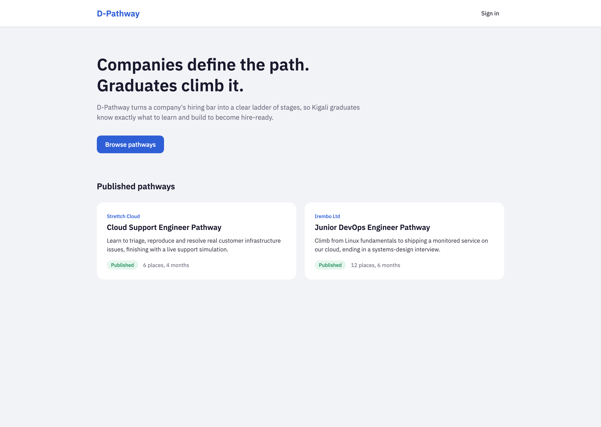
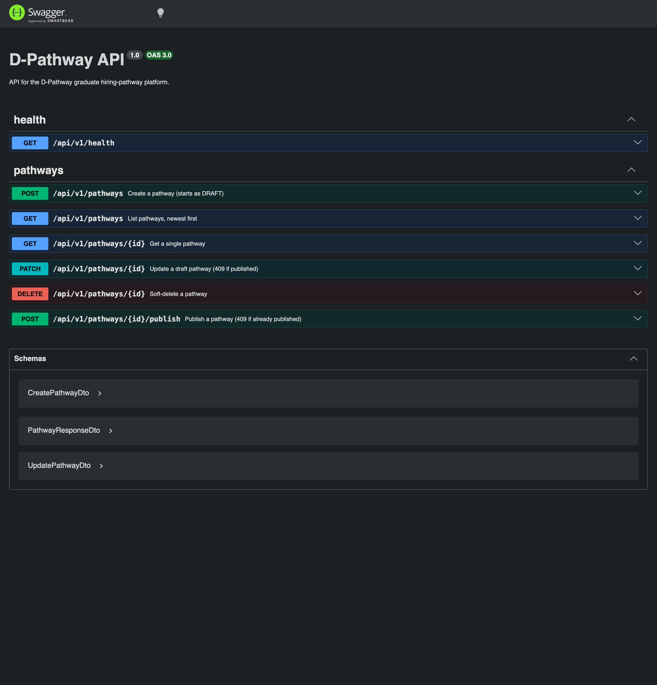

# D-Pathway

> **Status:** foundation phase (demo). A running API with the `Pathway` model and
> CRUD, a web home page that lists published pathways, and PostgreSQL in Docker.
> Stages, enrolments, submissions, reviews, auth and uploads come in later phases.

## Description

D-Pathway is a web platform for the Kigali, Rwanda graduate labour market. A
company authors a **pathway** — an ordered ladder of stages describing exactly
how a graduate becomes hire-ready for that company — and graduates climb it.
This phase builds only the foundation: a NestJS API exposing the `Pathway`
model, a Next.js home page that shows published pathways, and a Dockerised
PostgreSQL database.

## Repository

<!-- TODO: add the public repository URL here -->

## Tech stack

- **API:** Node 24 LTS, NestJS 12 (ESM), TypeORM 0.3 + PostgreSQL 16, `@nestjs/config` + Joi, class-validator, Swagger. Vitest, oxlint.
- **Web:** Next.js 16 (App Router), React 19, TypeScript 5.9, Tailwind CSS 4, IBM Plex Sans via `next/font`.
- **Infra:** PostgreSQL 16 in Docker Compose.

## Prerequisites

- Node 24 LTS
- Docker (for PostgreSQL)

## Setup

```bash
git clone <repo-url>
cd d-pathway

# 1. Database
docker compose up -d

# 2. API (http://localhost:3000)
cd api
npm ci
cp .env.example .env
npm run migration:run
npm run seed
npm run dev

# 3. Web (http://localhost:3001) — in a second terminal
cd web
npm ci
cp .env.example .env
npm run dev
```

## Designs

Figma style guide: <!-- TODO: paste the Figma file URL here -->

Screenshots of the delivered foundation:

| Home page | API docs (Swagger) |
|---|---|
|  |  |

## API documentation

Swagger UI: http://localhost:3000/docs

Seven routes under the `/api/v1` prefix:

| Method | Path | Purpose |
|---|---|---|
| GET | `/health` | Service + database health |
| POST | `/pathways` | Create a pathway (starts `DRAFT`) |
| GET | `/pathways` | List pathways (`?status=PUBLISHED` optional) |
| GET | `/pathways/:id` | Get one pathway |
| PATCH | `/pathways/:id` | Update a draft (409 if published) |
| POST | `/pathways/:id/publish` | Publish (409 if already published) |
| DELETE | `/pathways/:id` | Soft-delete |

## Deployment plan

_(Planned, not implemented in this phase.)_ API run under pm2 behind Caddy on a
Strettch Cloud compute instance; PostgreSQL in Docker on the same host; GitHub
Actions deploying on push to `main`.

## Project structure

```
d-pathway/
├── docker-compose.yml        # postgres:16-alpine
├── api/                      # NestJS 12 (ESM)
│   └── src/
│       ├── main.ts           # /api/v1 prefix, ValidationPipe, CORS, Swagger
│       ├── config/           # @nestjs/config + Joi schema
│       ├── database/         # TypeOrmModule, data-source, migrations, seeds
│       ├── common/           # BaseEntity, PathwayStatus enum, exception filter
│       └── modules/
│           ├── health/       # GET /health
│           └── pathways/     # entity, controller, service (+spec), DTOs
└── web/                      # Next.js 16 (App Router)
    └── src/
        ├── app/              # layout, home page, globals.css (design tokens)
        ├── components/       # site-header, pathway-card, empty-state
        └── lib/              # api client, Pathway type
```

## Note on Node version

This machine's default Node is 23.x, which the NestJS/Next toolchains do not
support. Use Node 24 LTS (e.g. `nvm use 24`) for all `api/` and `web/` commands.

